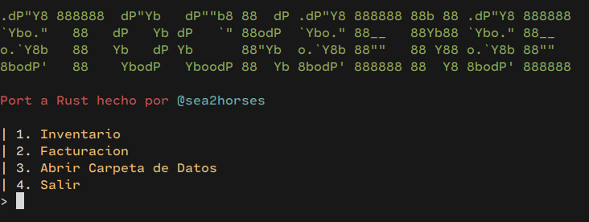
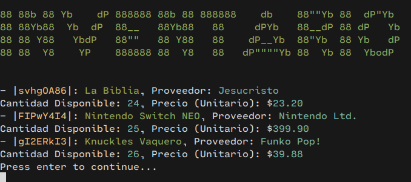
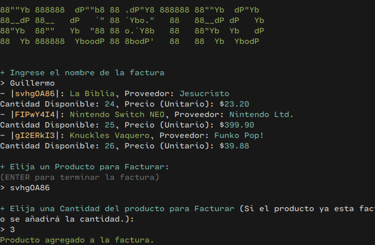
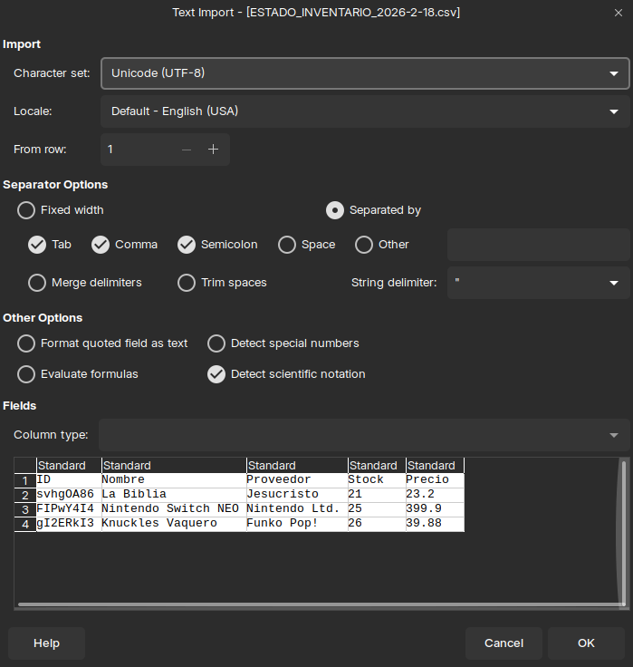
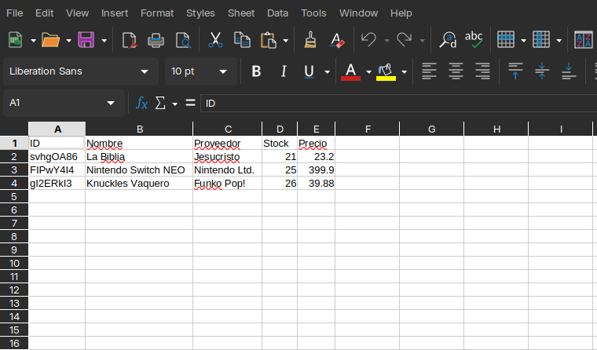

<h1>StockSense (Rust)</h1>



<p align="center">
    
    
</p>

StockSense es una **aplicación integral de código abierto** para **gestión de inventarios y facturación**. Esta versión es un **port en Rust** con la misma funcionalidad principal del proyecto original (excepto el módulo de logs), con una base de código más clara y robusta.

<br>

## Tabla de Contenidos
- [Modulos](#modulos)
	- [Inventario](#inventario)
	- [Facturación](#facturación)
	- [Exportación a CSV](#exportación-a-csv)
- [Tecnologías Usadas](#tecnologías-usadas)
- [Disponibilidad](#disponibilidad)
- [Uso / Compilacion](#uso--compilacion)
- [Créditos](#créditos)

<br>

# Modulos

StockSense tiene distintos modulos que ayudan al usuario a manejar y facturar su inventario de manera eficiente.

## Inventario



El módulo de Inventario **permite agregar, remover y editar productos** (nombre, proveedor, precio y unidades). También **muestra el estado actualizado del inventario** para mantener información precisa de los productos disponibles.

## Facturación



El módulo de Facturación está **conectado al inventario**, facilitando la facturación de múltiples productos. **Calcula subtotales y total final** y mantiene la información sincronizada con el inventario.

## Exportación a CSV




Permite **exportar el estado del inventario** y **las facturas generadas** a CSV para análisis en herramientas como Excel.

<br>

# Tecnologías Usadas

- Rust
- Cargo

<br>

# Disponibilidad

Esta versión **es multiplataforma** y funciona en Windows, macOS y Linux.

<br>

# Uso / Compilacion

## Requisitos
- Rust (stable) y Cargo

## Compilar
```bash
cargo build --release
```

## Ejecutar
```bash
cargo run
```

El binario final queda en `target/release/stocksense`.

<br>

# Créditos

- @sea2horses *(Port a Rust y mantenimiento)*

Repositorio Original: https://github.com/sea2horses/StockSense
